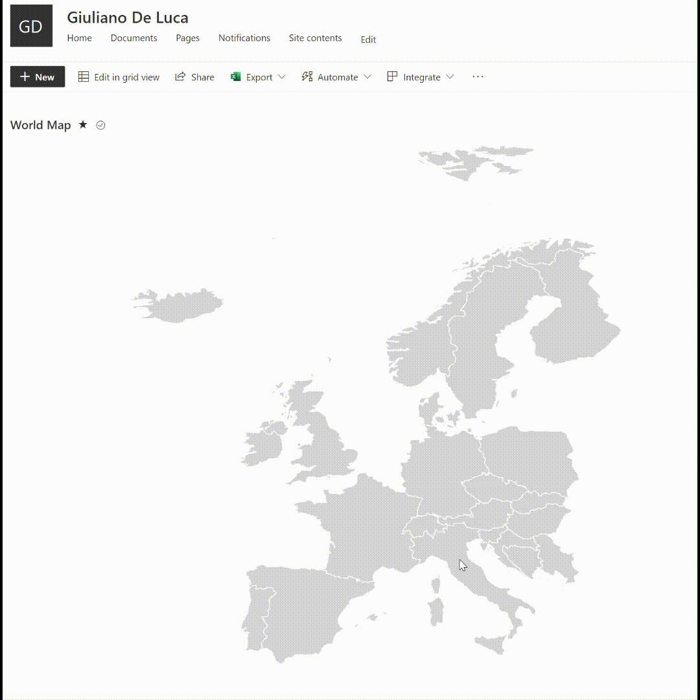

# SharePointListInteractiveMaps
Interactive Maps created using Microsoft SharePoint Lists view &amp; column formatting

Steps to install the solution:
- Create a new SharePoint List
- Create a new view
- Format the view, copy the content in the file **Europe.json**, and paste it.